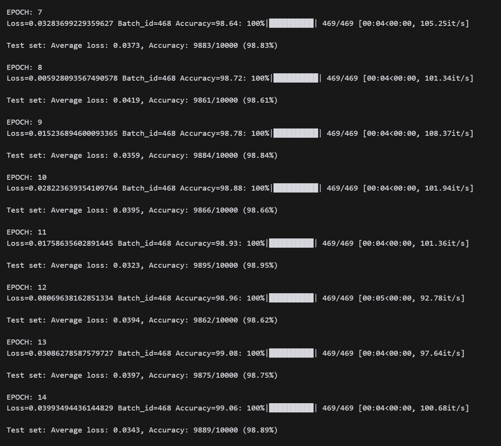
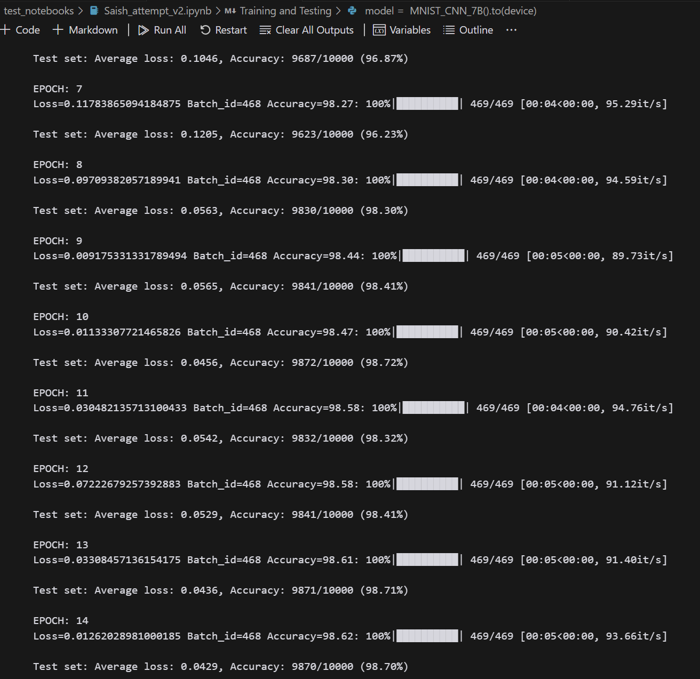
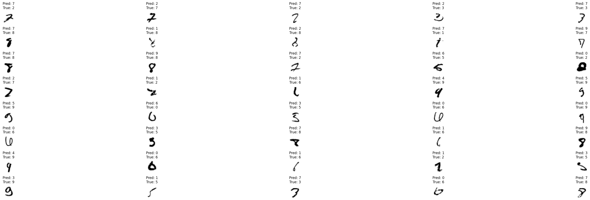
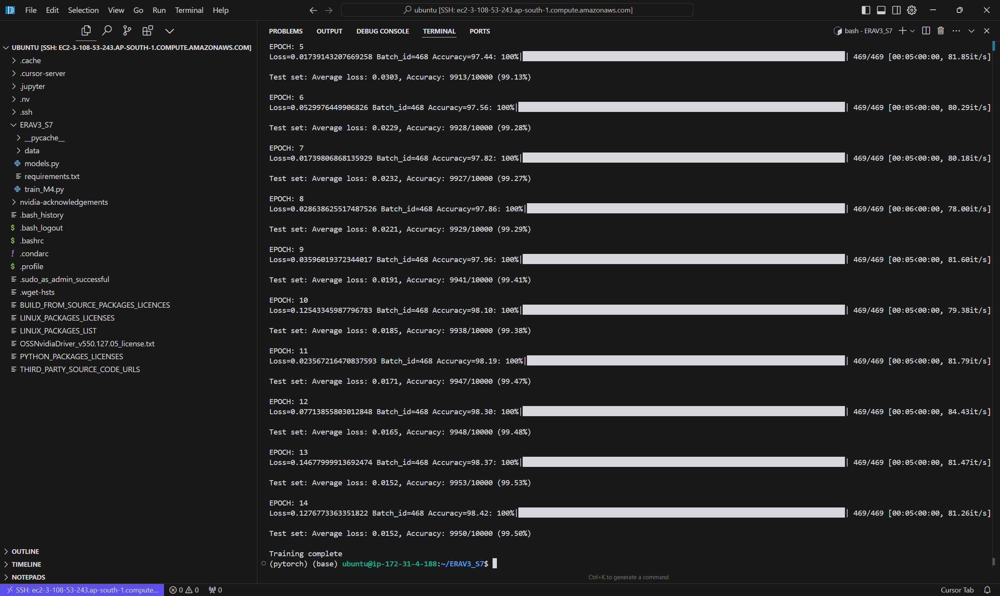

# MNIST CNN Lite Model Architecture- TSAI ERA V3 Session 7 Assignment

This repository contains a stepwise implementation of a lightweight CNN model for the MNIST dataset.

### Steps to make a CNN model:

Step 1 - Set up <br >
Step 2 - Basic Skeleton <br>
Step 3 - Lighter Model <br>
Step 4 - Batch Normalization
Step 5 - Regularization <br>
Step 6 - Global Average Pooling <br>
Step 7 - Increasing Capacity <br>
Step 8 - Correct MaxPooling Location <br>
Step 9 - Image Augmentation <br>
Step 10 - Playing naively with Learning Rates <br>
Step 11 - Discipline <br>

## Assignment Requirements

The new target for MNIST Model is-
1. **99.4%** (this must be consistently shown in your last few epochs, and not a one-time achievement)
2. Less than or equal to **15 Epochs**
3. Less than **8000 Parameters**
4. Do this using your modular code. Every model that you make must be there in the model.py file as Model_1, Model_2, etc.
5. Once done, train on SageMaker or EC2

## Repository Structure
```
 MNIST_CNN_Lite/
   ├── README.md
   ├── models.py
   │   └── MNIST_CNN_M1
   │   └── MNIST_CNN_M2
   │   └── MNIST_CNN_M3
   │   └── MNIST_CNN_M4
   ├── train_M1.py
   ├── train_M2.py
   ├── train_M3.py
   ├── train_M4.py
   └── requirements.txt
```

## Created Models

### Model 1- MNIST_CNN_M1

Steps Covered: <br>
Step 1 - Set up <br >
Step 2 - Basic Skeleton <br>
Step 3 - Lighter Model <br>

Model 1 Architecture:
```
----------------------------------------------------------------
        Layer (type)               Output Shape         Param #
================================================================
            Conv2d-1           [-1, 10, 26, 26]              90
              ReLU-2           [-1, 10, 26, 26]               0
            Conv2d-3           [-1, 20, 24, 24]           1,800
              ReLU-4           [-1, 20, 24, 24]               0
         MaxPool2d-5           [-1, 20, 12, 12]               0
            Conv2d-6           [-1, 10, 12, 12]             200
              ReLU-7           [-1, 10, 12, 12]               0
            Conv2d-8           [-1, 10, 10, 10]             900
              ReLU-9           [-1, 10, 10, 10]               0
           Conv2d-10             [-1, 20, 8, 8]           1,800
             ReLU-11             [-1, 20, 8, 8]               0
        MaxPool2d-12             [-1, 20, 4, 4]               0
           Conv2d-13             [-1, 10, 4, 4]             200
             ReLU-14             [-1, 10, 4, 4]               0
           Conv2d-15             [-1, 10, 1, 1]           1,600
             ReLU-16             [-1, 10, 1, 1]               0
================================================================
Total params: 6,590
Trainable params: 6,590
Non-trainable params: 0
----------------------------------------------------------------
Input size (MB): 0.00
Forward/backward pass size (MB): 0.36
Params size (MB): 0.03
Estimated Total Size (MB): 0.39
----------------------------------------------------------------
```

Target:
1. Get the set-up right and basic skeleton right
2. Write layers accoding to the session understanding and still maintain it within requireed parameters.

Logs:<br>


Results:
1. Parameters: **6,590** ✅
2. Best Training Accuracy: 99.08%
3. Best Test Accuracy: 98.95%

Analysis:
1. Extremely Efficient Model, got the basic skeleton right.
2. Model is little over-fitting, but some modification can help us achieve the desired accuracy, and also reduce the number of parameters.

### Model 2- MNIST_CNN_M2

Steps Covered: <br>
Step 4 - Batch Normalization<br>
Step 5 - Regularization <br>
Step 6 - Global Average Pooling <br>

Model 2 Architecture:
```
----------------------------------------------------------------
        Layer (type)               Output Shape         Param #
================================================================
            Conv2d-1            [-1, 8, 26, 26]              72
       BatchNorm2d-2            [-1, 8, 26, 26]              16
              ReLU-3            [-1, 8, 26, 26]               0
            Conv2d-4            [-1, 8, 24, 24]             576
       BatchNorm2d-5            [-1, 8, 24, 24]              16
              ReLU-6            [-1, 8, 24, 24]               0
            Conv2d-7           [-1, 16, 22, 22]           1,152
       BatchNorm2d-8           [-1, 16, 22, 22]              32
           Dropout-9           [-1, 16, 22, 22]               0
             ReLU-10           [-1, 16, 22, 22]               0
        MaxPool2d-11           [-1, 16, 11, 11]               0
           Conv2d-12            [-1, 8, 11, 11]             128
      BatchNorm2d-13            [-1, 8, 11, 11]              16
             ReLU-14            [-1, 8, 11, 11]               0
           Conv2d-15              [-1, 8, 9, 9]             576
      BatchNorm2d-16              [-1, 8, 9, 9]              16
             ReLU-17              [-1, 8, 9, 9]               0
           Conv2d-18             [-1, 16, 7, 7]           1,152
      BatchNorm2d-19             [-1, 16, 7, 7]              32
          Dropout-20             [-1, 16, 7, 7]               0
             ReLU-21             [-1, 16, 7, 7]               0
           Conv2d-22             [-1, 10, 7, 7]             160
        AvgPool2d-23             [-1, 10, 1, 1]               0
================================================================
Total params: 3,944
Trainable params: 3,944
Non-trainable params: 0
----------------------------------------------------------------
Input size (MB): 0.00
Forward/backward pass size (MB): 0.55
Params size (MB): 0.02
Estimated Total Size (MB): 0.56
----------------------------------------------------------------
```

Target:
1. Add Batch Normalization after every Convolution Layer
2. Add Dropout after few layers
3. Add Global Average Pooling
4. As Regularization is added, try to reduce the number of parameters further below params of Model 1

Logs:<br>


Results:
1. Parameters: **3,944** ✅
2. Best Training Accuracy: 98.62%
3. Best Test Accuracy: 98.72% 

Analysis:
1. Even though the model parameters are reduced by **40%**, accuracy has only slightly decreased.
2. Model has started to underfit, probably because of lesser number of parameters it is not able to extract all features during training.
3. 99.4% target is still not achieved, will have to add last parts to bridge the gap.


### Model 3- MNIST_CNN_M3

Steps Covered: <br>
Step 7 - Increasing Capacity <br>
Step 8 - Correct MaxPooling Location <br>
Step 9 - Image Augmentation <br>
Step 10 - Playing naively with Learning Rates <br>

Model 3 Architecture:
```
----------------------------------------------------------------
        Layer (type)               Output Shape         Param #
================================================================
            Conv2d-1            [-1, 4, 26, 26]              36
              ReLU-2            [-1, 4, 26, 26]               0
       BatchNorm2d-3            [-1, 4, 26, 26]               8
           Dropout-4            [-1, 4, 26, 26]               0
            Conv2d-5            [-1, 8, 24, 24]             288
              ReLU-6            [-1, 8, 24, 24]               0
       BatchNorm2d-7            [-1, 8, 24, 24]              16
           Dropout-8            [-1, 8, 24, 24]               0
            Conv2d-9           [-1, 16, 22, 22]           1,152
             ReLU-10           [-1, 16, 22, 22]               0
      BatchNorm2d-11           [-1, 16, 22, 22]              32
          Dropout-12           [-1, 16, 22, 22]               0
           Conv2d-13           [-1, 16, 20, 20]           2,304
             ReLU-14           [-1, 16, 20, 20]               0
      BatchNorm2d-15           [-1, 16, 20, 20]              32
          Dropout-16           [-1, 16, 20, 20]               0
        MaxPool2d-17           [-1, 16, 10, 10]               0
           Conv2d-18            [-1, 8, 10, 10]             128
           Conv2d-19             [-1, 16, 8, 8]           1,152
             ReLU-20             [-1, 16, 8, 8]               0
      BatchNorm2d-21             [-1, 16, 8, 8]              32
          Dropout-22             [-1, 16, 8, 8]               0
           Conv2d-23             [-1, 16, 6, 6]           2,304
             ReLU-24             [-1, 16, 6, 6]               0
      BatchNorm2d-25             [-1, 16, 6, 6]              32
          Dropout-26             [-1, 16, 6, 6]               0
AdaptiveAvgPool2d-27             [-1, 16, 1, 1]               0
           Conv2d-28             [-1, 10, 1, 1]             160
================================================================
Total params: 7,676
Trainable params: 7,676
Non-trainable params: 0
----------------------------------------------------------------
Input size (MB): 0.00
Forward/backward pass size (MB): 0.72
Params size (MB): 0.03
Estimated Total Size (MB): 0.75
----------------------------------------------------------------
```

Target:
1. Increased the capacity to extract more features.
2. Added Image Augmentation such as rotation and shear.
3. Added Dropout to all the layers.
4. Added One Cycle Learning Rate Policy
5. Added a 1x1 kernel after GAP to reduce the number of parameters, following Rohan sir's code.

Logs:<br>


Results:
1. Parameters: **7,676** ✅
2. Best Training Accuracy: 97.89%
3. Best Test Accuracy: **99.27%**

Analysis:
1. Model is highly *underfitting*, as clearly visible from the training and test accuracy. That is a good thing because that shows our model is robust on unseen data.
2. But the model is still not able to encode all the features, and that is why it is not able to bridge the gap.
3. Tried a lot of different things here, more regularization, changing the number of layers, different learning rates, different optimizers, different image augmentation, different regularization techniques, but nothing seemed to be working.

Misclassified Images:<br>


### Model 4- MNIST_CNN_M4 ✅

Steps Covered: <br>
Step 11 - Discipline <br>

Finally after a lot of trial and error, and following Rohan sir's session suggestions, I was able to achieve the desired accuracy.

Model 4 Architecture:
```
----------------------------------------------------------------
        Layer (type)               Output Shape         Param #
================================================================
            Conv2d-1            [-1, 8, 26, 26]              72
              ReLU-2            [-1, 8, 26, 26]               0
       BatchNorm2d-3            [-1, 8, 26, 26]              16
           Dropout-4            [-1, 8, 26, 26]               0
            Conv2d-5           [-1, 16, 24, 24]           1,152
              ReLU-6           [-1, 16, 24, 24]               0
       BatchNorm2d-7           [-1, 16, 24, 24]              32
           Dropout-8           [-1, 16, 24, 24]               0
            Conv2d-9           [-1, 10, 24, 24]             160
        MaxPool2d-10           [-1, 10, 12, 12]               0
           Conv2d-11           [-1, 10, 10, 10]             900
             ReLU-12           [-1, 10, 10, 10]               0
      BatchNorm2d-13           [-1, 10, 10, 10]              20
          Dropout-14           [-1, 10, 10, 10]               0
           Conv2d-15             [-1, 16, 8, 8]           1,440
             ReLU-16             [-1, 16, 8, 8]               0
      BatchNorm2d-17             [-1, 16, 8, 8]              32
          Dropout-18             [-1, 16, 8, 8]               0
           Conv2d-19             [-1, 16, 6, 6]           2,304
             ReLU-20             [-1, 16, 6, 6]               0
      BatchNorm2d-21             [-1, 16, 6, 6]              32
          Dropout-22             [-1, 16, 6, 6]               0
           Conv2d-23             [-1, 10, 4, 4]           1,440
AdaptiveAvgPool2d-24             [-1, 10, 1, 1]               0
================================================================
Total params: 7,600
Trainable params: 7,600
Non-trainable params: 0
----------------------------------------------------------------
Input size (MB): 0.00
Forward/backward pass size (MB): 0.58
Params size (MB): 0.03
Estimated Total Size (MB): 0.61
----------------------------------------------------------------
```
Target:
1. Remove the 1x1 Convolution Layer after GAP, following Rohan sir's suggestion.
2. Tried adjusting slightly different values of rotation and shear looking at misclassified images.
3. Re-adjust the number of parameters and layer structure.


Logs:<br>


Results:
1. Parameters: **7,600** ✅
2. Best Training Accuracy: 98.42%
3. Best Test Accuracy: **99.53%** ✅

Analysis:
1. Made subtle changes to the number of channels in hidden layers, which seemed to be doing the magic.
2. The Key observation was that **the number of channels in middle hidden layers should atleast be 10, which is the number of output classes**. Ealier I had kept it 8 and hence model was confusing between numbers such as 1 and 7. 
3. Increased the number of parameters in starting layers to extract more enhanced features.
4. The model is still *underfitting*, but the test accuracy is **99.53%** which is the best test accuracy I have achieved so far. I believe there is still scope to improve performance on even lesser number of parameters and epochs.
4. Model is showing greater than **99.4%** accuracy consistently in last few epochs, which is a great sign.


## AWS Sagemaker/EC2 usage

As part of the assignment, we had to train the best model on AWS Sagemaker/EC2.<br>
I have trained the M4 model on EC2, connecting my cursor to the EC2 instance and training the model from Cursor IDE itself.

Logs Picture:<br>



